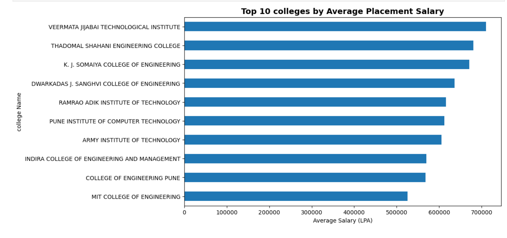

# College Placement Data Analysis

Analyzed college placement data to find trends, top colleges, and top hiring companies using Excel and Python.
##  Visualizations

### Top 10 Colleges by Average Salary

## Key Highlights
- Top 10 Colleges by Average Placement Salary
- Top Hiring Companies
- Students Placed Trend by Year

## Data Cleaning & Tools
- Cleaned data in Excel and Python (pandas)
- Visualizations created with Python (matplotlib)
- Jupyter Notebook used for analysis

## Insights
- Identified colleges offering higher salaries
- Determined companies hiring the most students
- Observed year-wise placement trends

## Learning Outcome
- Learned data cleaning, visualization, and analysis
- Gained ability to interpret and present insights
